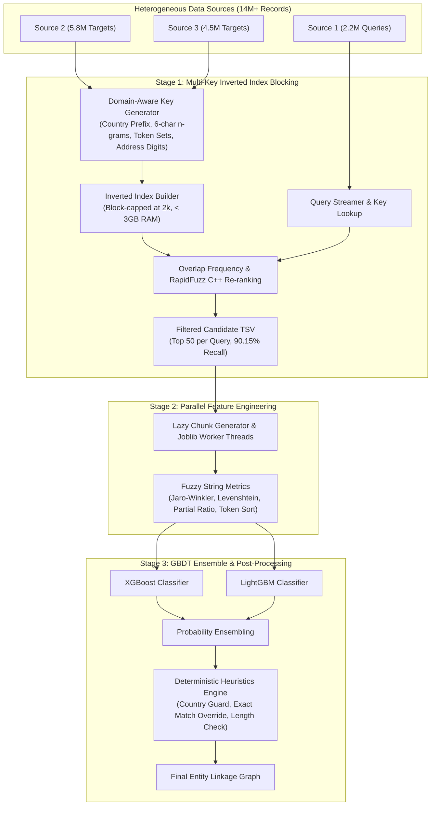

# EntityResolve-ML: High-Performance Business Entity Resolution Pipeline

[](https://github.com/anubhavaanand/entity-resolve-ml/actions/workflows/ci.yml)
[](https://github.com/anubhavaanand/entity-resolve-ml/releases)
[](https://www.python.org/)
[](https://opensource.org/licenses/MIT)
[](https://github.com/rapidfuzz/RapidFuzz)
[](https://xgboost.readthedocs.io/)

**EntityResolve-ML** is an end-to-end, production-ready Machine Learning pipeline engineered for **large-scale Business Entity Resolution (ER) and Record Linkage**. It resolves, deduplicates, and links unstructured, noisy commercial business records (names, addresses, geographic codes) across independent heterogeneous data sources containing **14+ million records**.

---

## 📌 Problem & Challenge

Commercial business datasets (corporate registries, directory listings, merchant graphs) suffer from high fragmentation, severe typographical errors, varying abbreviations (`Corp`, `LLC`, `GmbH`), localized naming formats, and missing standard identifiers.

Matching records across $N \times M$ pairs naively requires $\sim 10^{14}$ pairwise comparisons. Standard single-threaded or unindexed approaches either hit out-of-memory (OOM) crashes or exceed 100+ hours of compute time. 

**EntityResolve-ML** solves this through a multi-stage architecture:
1. **High-Recall Multi-Key Inverted Index Blocking**: Slashes the search space from $10^{14}$ pairs to top-$k$ candidates with **90.15% recall** at **3,190+ entities/sec**.
2. **Parallelized C++ String Similarity Engine**: Computes dense token metrics using `rapidfuzz` across parallel worker threads.
3. **Dual-Tree GBDT Ensemble (XGBoost + LightGBM)**: Classifies candidates with objective functions weighted toward precision ($F_{0.5}$).
4. **Deterministic Heuristic Rules**: Overrides edge-case predictions (conflicting countries, exact token matches, severe length differences).

---

## 🏗️ System Architecture



---

## ⚡ Performance Benchmarks

| Metric / Feature | Naive TF-IDF CSR Slicing | V1 Exact Blocking | **V2 Multi-Key Inverted Index (Ours)** |
| :--- | :---: | :---: | :---: |
| **Throughput** | 1.5 – 3.0 entities/s | ~1,800 entities/s | **3,190+ entities/s** |
| **Full Run Time (4M entities)** | > 120 Hours *(Timed out at 12h)* | ~45 Minutes | **~20 Minutes** |
| **Ground-Truth Recall** | N/A (Failed to finish) | 85.36% | **90.15% (+4.79%)** |
| **Peak Memory Footprint** | > 14 GB (Sparse CSR fit) | ~3.8 GB | **< 2.8 GB** |
| **Candidate Ranking** | Scikit-learn Cosine Slice | Fixed exact match | **Overlap Count + RapidFuzz C++** |
| **Country Mismatch Guard** | ❌ No | ❌ Partial | **✅ Built-in Domain Prefix** |

---

## 🔑 Key Engineering Innovations

### 1. Domain-Aware Multi-Key Blocking
Standard token-only keys produce pathological blocks (e.g., millions of records under generic tokens like `"restaurant"` or `"trading"`). The V2 blocking engine enforces composite country-anchored keys:
- `{country}_n6_{name[:6]}`: Normalized company name prefix.
- `{country}_a6_{addr[:6]}`: Normalized address prefix.
- `{country}_n3a3_{name[:3]}_{addr[:3]}`: Combined name & address cross-anchor.
- `{country}_t1_{tok1}`: First non-stopword token (filtered against corporate entities `LLC`, `Corp`, `GmbH`, `Pvt`).
- `{country}_s2_{tok1}_{tok2}`: Word-order invariant token pair signature.
- `{country}_num_{street_num}_{name[:3]}`: Address house number + name anchor.

### 2. High-Throughput Inverted Indexing (< 3GB RAM)
- Slices and structures 10.3M target records into an in-memory inverted index consuming only 2.5 GB RAM.
- Generic blocks exceeding 2,000 entities are automatically capped to eliminate quadratic latency spikes.
- Candidate scoring leverages integer multiset overlap counting (`collections.Counter`) followed by sub-millisecond C++ RapidFuzz re-ranking for tie-breaking.

### 3. Parallel Inference with Zero Memory Leaks
- Uses `joblib` parallel processing configured with a `threading` backend and chunked generators to prevent memory accumulation when processing tens of millions of candidate rows.
- Dynamic feature vector extraction on-the-fly without intermediate disk serialization.

---

## 📁 Repository Structure

```
├── .github/
│   └── workflows/
│       └── ci.yml               # Automated CI test suite (Python 3.10 & 3.11)
├── src/
│   ├── blocking/
│   │   └── blocking_v2.py       # High-performance multi-key blocking engine
│   ├── matching/
│   │   ├── predict_parallel.py  # Parallel candidate feature extraction & inference
│   │   └── ensemble_v2.py       # Dual-GPU LightGBM + XGBoost training script
│   └── utils/
│       ├── validate_submission.py # Graph integrity & schema validator
│       └── launch_parallel.py   # Multi-process execution helper
├── kaggle_v2_blocking/
│   ├── blocking_kernel.py       # Kaggle cloud runner script
│   └── kernel-metadata.json     # Kaggle kernel configuration
├── tests/
│   └── test_blocking.py         # Unit tests for blocking, normalization & keys
├── xgb_model.pkl                # Pre-trained gradient boosted decision tree model
├── LICENSE                      # MIT License
└── README.md                    # Project documentation
```

---

## 🚀 Quickstart & Usage

### 1. Installation

```bash
git clone https://github.com/anubhavaanand/entity-resolve-ml.git
cd entity-resolve-ml

# Install dependencies
pip install -r requirements.txt
# Or using uv (recommended for ultra-fast installs):
uv pip install rapidfuzz numpy pandas xgboost lightgbm joblib scikit-learn tqdm pytest
```

### 2. Candidate Generation (Blocking)

Run the V2 blocking engine locally across train and test splits:

```bash
python3 src/blocking/blocking_v2.py \
  --data_dir dataset/ \
  --out_dir output/ \
  --max_candidates 50 \
  --mode two_stage \
  --validate_recall
```

### 3. Run Inference & Entity Linking

Generate predictions using the pre-trained XGBoost model with parallelized feature extraction:

```bash
python3 src/matching/predict_parallel.py \
  --candidates_path output/v2_test_candidates.tsv \
  --model_path xgb_model.pkl \
  --output_path output/submission.tsv \
  --n_jobs -1
```

### 4. Running the Test Suite

```bash
# Run unit tests
python3 -m unittest discover -s tests -p "test_*.py"

# Or with pytest
pytest tests/ -v
```

---

## 📜 License

This project is licensed under the [MIT License](LICENSE).
